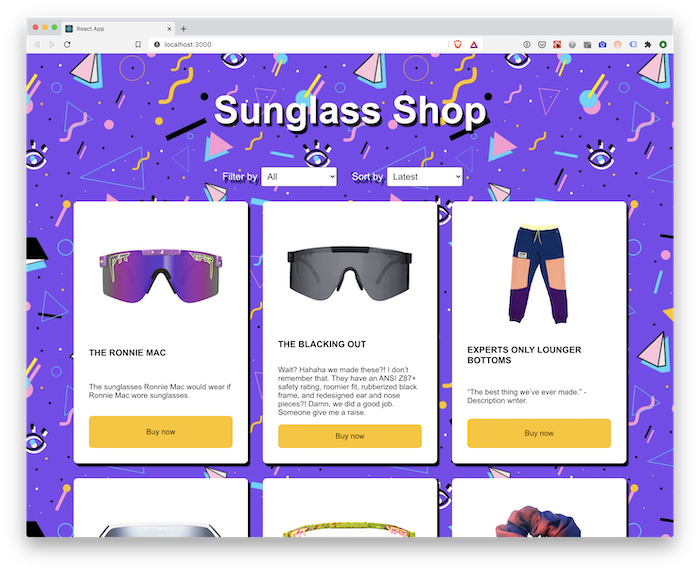

# 01 Exercise - Sunglass Shop in React

## Brief

The Sunglass eCommerce site has been converted to a React Application, but it only uses one main component. You need to refactor the existing code to make use of React Components.



## Rationale

Using many small components is good practice because it makes React code re-usable, and makes it easier to implement features such as the _Filter by_ dropdown.

## Getting Started

1. Open the project in VS Code, and open your terminal
2. Type: `npm install` and then `npm start`. The React Application should open in your browser
3. Open `src/App.js` in VS Code. This is the file that you will start working from

## Instructions Part A - Create `FilterBy` and `SortBy` components

1. Look through the JSX inside `App.js` and find the code that relates to the _Filter by_ dropdown
2. Create a new React component inside `App.js` named `FilterBy` (Note the capital F). Make it return the existing code related to the _Filter by_ dropdown.
3. Replace the existing code with the new `<FilterBy />` React component
4. Repeat the above for the _Sort by_ dropdown

**Acceptance criteria**

- The _Filter by_ dropdown exists in a component
- The _Sort by_ dropdown exists in a component

## Instructions Part B - Single Product Component

**Note:** This part of the exercise **should not** use Loops! This will be covered in another exercise.

1. Create a new component called `Product` in `App`
2. Make it return a single product list item. Use the existing code in `App.js` as a reference.
   - The `Product` component should accept the following props: `image`, `name`, and `description`
3. Replace the existing products with the new `Product` component, making sure to pass in the correct product properties

**Acceptance criteria**

- Each product is displayed using a `<Product>` component
- No loops or map functions are used to display the products
- The `Product` component uses props for each of the dynamic bits of data, e.g:

  ```jsx
  <Product
    image={products[0].images[0]}
    name={products[0].name}
    description={products[0].description}
  />
  ```

## Instructions Part C - Products List Component

1. Create a new component names `Products`
2. Make it return the existing `<ul className="product-grid">...</ul>`, including the `<Product>` components.
3. Replace the existing `<ul>` with the new `<Products>` component

**Acceptance criteria**

- The `<ul className="product-grid">...</ul>` element should be rendered from a `<Products>` component
- the `<Product>` components for each product should be rendered from inside the `<Products>` component

---

# Submit your Exercise

- [ ] Commits are pushed to GitHub
- [ ] Automated tests pass in GitHub

---

## Exercise answer walkthrough

- [Sunglass Shop in React components exercise walkthrough](https://www.loom.com/share/9614725bff3a4f209bdf63decbc5c37a)